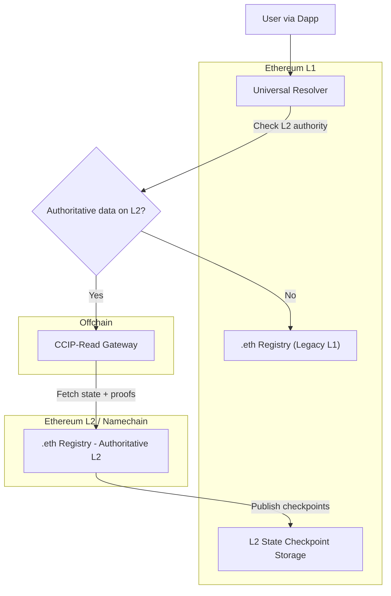

## ENS v2: A primer

Given that people typically don't remember their 12-word seed phrase, it's no surprise that they can't recall or verify a 40-hexadecimal blockchain wallet. This creates significant UX and security issues &mdash; exposing people to the outcomes of copy/pasta and typosquatting incidents. 

With over 1 million <!-- (didn't find reliable data source 2 year old Dune dash says [1.6 million active names](https://dune.com/ethereumnameservice/ens)) --> active names, the Ethereum Name Service (ENS) solves for this by allowing users to describe a wallet address with simple, human-readable names like alice.eth. ENS goes beyond simplifying wallet address resolution, linking domain names to a variety of records, including decentralized website hashes (IPFS), DNS bridging records, and more.

ENSv1, however, was built before L2s, when users bore high and unpredictable L1 gas costs. Times have changed, and so too has ENS. This article is a primer on what’s new in ENSv2 and how it makes record resolution easier for everyone.

## ENSv2 an overview

The ENSv2 system introduces a more efficient resolution mechanism leveraging a layered architecture, as illustrated in Figure 1, this involves Ethereum L1, L2/s, and offchain components.

Figure 1: High-level overview of the ENSv2 resolution flow

<!-- 

- L1 fallback resolver role is bundled into Universal Resolver.

- The migration/ejection contracts are omitted 

- The hierarchical registry structure (graph of registries) isn’t shown  -->

Let's double-click on the most important changes brought in v2 and the improvements they offer. 

### Names will be registered on a bespoke L2

**Change from v1**: All .eth registrations from Ethereum L1 will be migrated to a new L2 registry on Namechain, which will manage all new registrations. 

**No Change**: Name ownership is enforced by the registry, and controller contracts are responsible for handling logic such as registration, renewal, and payments.

**What's the win?** By leveraging the Namechain L2, the gas costs are reduced by an order of magnitude when compared to L1 fees. This will make ENS available to a significantly wider user group.

### Resolution is handled by a Universal Resolver

**Change from v1**: Instead of (potentially) querying individual resolver contracts for each name, all resolutions go through a single Universal Resolver on Ethereum L1.

**No Change**: Users and dapps still receive authoritative results for each name; ownership and resolver logic remain enforced by the registry.

**What’s the win?** Users and dapps can resolve names without needing to know which resolver contract to query, simplifying the UX and reducing potential errors.

### Cross-chain data availability via CCIP-read

**Change from v1**: The Universal Resolver can fetch data from the L2 registry offchain using Cross-Chain Interoperable Protocol-read (CCIP-read), while still verifying responses against the L1 checkpoint.

**No Change**: Resolution remains secure and authoritative; users are never forced to blindly trust the L2.

**What’s the win?** Name resolution is faster and cheaper, while maintaining L1 security guarantees. L1 dapps can benefit from L2 efficiency without sacrificing trust.

### Directional graph of registries

**Change from v1**: Transitioning from a flat structure to a directional graph of (hierarchical) registries. 

**No Change**: The registry continues to enforce ownership and transfer rules.

**What’s the win?** Enables flexible ownership models, allowing each name to define its own ownership and transfer model. Furthermore, names can expire cleanly and immediately, improving UX and reducing stale data in the registry.

## What does ENSv2 mean for developers?

ENSv2 offers a clean, developer-friendly resolution service. The L1 Universal Resolver becomes the primary canonical onchain entrypoint in ENSv2. Resolving a domain requires a single API call to the Universal Resolver contract, regardless of whether the domain itself is registered on Ethereum L1 or migrated to a L2.

## What does ENSv2 mean for users?

All existing .eth registrations will be migrated to Namechain, and all new .eth registrations will happen on the user-selected L2 &mdash; taking advantage of the lower gas fees and faster transaction times that L2s offer. However, registrations are not fixed to the registration L2. Users will have the option to move between L1 and L2 registries, providing flexibility in selecting where their domain’s authoritative registry lives and operates.

Migrating registration back to the Ethereum L1 registry enables users to issue subnames on different L2 chains, facilitating the cross-L2 interoperability and management needed for multi-L2 subdomain issuance. Returning to the L1 also supports users who prioritize Ethereum mainnet's security and lower latency.

## Conclusion

ENSv2 combines L2 efficiency with L1 security, extending secure, simple transaction and publishing capabilities across blockchains, decentralized websites, and traditional DNS domains. With v2, ENS continues to deliver on its vision to empower seamless resolution and user-friendly naming for everyone.

Want to learn more? Checkout the [ENSv2 design doc](https://docs.google.com/document/d/1xUt62ryeopEWNCvXXbZFeOcl3msT6k-7Bl-7t2BepxM/edit?usp=sharing).

<!-- Not covered: RegistryDatastore interface, shadow registries, ejection process internals -->