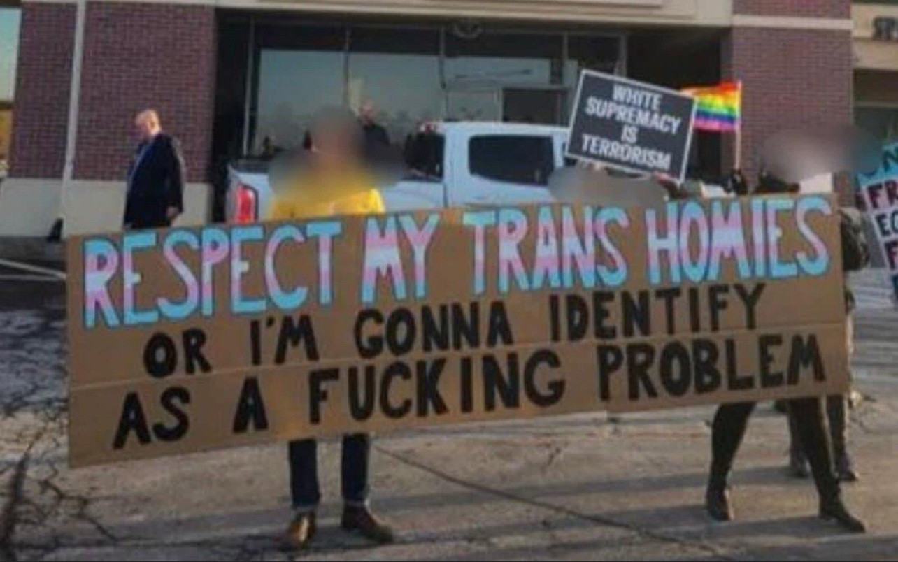

I am done with anyone who wants to have "conversations" about trans people. Because nearly everyone holding political power in the US today seems to believe it's up for debate whether trans people should get access to healthcare and have rights to pursue joyful, fulfilling lives. Republicans, starting around 2021 (after a failed attempt in 2016) have decided that trans people must be eradicated. But appallingly, many Democrats have started making it explicitly clear that they are willing to find compromise positions on this topic.

Democrats who treat any identity groups' right to exist as "up for debate" deserved to be chased out of politics and made a pariah in public life. They deserve a toe fungus that never goes away. They deserve socks that never dry. They deserve to lose all of their friends, until such a point that they recant their positions and work to undo the injustices they are encouraging at this moment.

Many people who listen to these cowardly politicians are attempting to build consensus around the idea that trans ideas are "too politically contentious" and people on the left who wish to defeat the authoritarians must drop the politicians. There's clear astroturfing happening on BlueSky, and I can only imagine it's worse on the MechaHitler platform that used to be called Twitter. People will point to recent polling, suggesting that the issue is unpopular, as if that is an argument against supporting the rights of your fellow humans. As if it is a reasonable argument to say "this groups rights are unpopular so they don't deserve them." Fuck that shit.

If you've encountered this messaging, they will point to recent polls showing growing support for the horrific laws and policies that Republicans are proposing and passing at a rapid pace. [Here's the Pew Report](https://www.pewresearch.org/short-reads/2025/02/26/americans-have-grown-more-supportive-of-restrictions-for-trans-people-in-recent-years/) earlier this year, where the entire analysis points to the fact that opinion on these questions is rapidly changing. These laws have gone from very unpopular to slightly less unpopular.

Cowardly dems would have you believe that trends are magical things that arise from the citizenry without any other reasons; that polls reveal the true will of the polity, and since we are democracy, we must listen! This is a load of horseshit, which [this piece covers quite well](https://www.nybooks.com/articles/2024/10/17/the-problems-with-polls-strength-in-numbers-morris/) ([Archive link](https://archive.is/Ohl7X) if you hit a paywall), including this astute summary:

>But the most fundamental problem with polling is that the phenomenon it claims to record—public opinion—has no coherent meaning or existence. The polling industry resolves this conundrum by simply making “public opinion” synonymous with its methods: polls record public opinion; public opinion is what polls record. Skeptics could see this sleight of hand from the start. “Dr. Gallup does not make the public more articulate,” Lindsay Rogers, a political scientist at Columbia University, wrote in an early polemic against polling in 1949. “He only estimates how in replying to certain questions, it would say ‘yes’ or ‘no’ or ‘don’t know.’ Instead of feeling the pulse of democracy, Dr. Gallup listens to its baby talk.”

But even if we pretend like the polling is useful information, cowardly Dems (both those holding power and those helping them build messaging) are missing the true message of the polls, and I'm just utterly sick of it.

The polls show—and that Pew article above emphasizes this—that people's opinions on trans issues are not fixed. They are moveable.

And right now nearly everyone in power has decided the best idea is to let Republicans determine where the opinions should be moved to.

I am desperate, genuinely desperate for the people with soft and hard power in the Democratic party to understand that they have immense power to stop this. That the polls are not saying "here's where people are moving" but instead "here's how you're failing." And I'd love them to stop failing. Yesterday.

There are a few people with Democratic power who are doing this, and part of my writing this small rant on my dumb website is to highlight the people with power who are using that power to push back against the Republican campaign to eradicate trans people.

Tim Walz, who is the governor of Minnesota (where I moved to this year!) has been a vocal champion of trans rights. In May, he gave the keynote at the California Democratic convention, where he [drew a line](https://www.lgbtqnation.com/2025/06/tim-walz-shames-dems-who-have-abandoned-trans-people-we-need-to-be-the-party-of-human-dignity/) I wish more were willing to fight for:

> I’m just going to say it, shame on any of us who throws a trans child under the bus for thinking they’re going to get elected. That child deserves our support. Don’t worry about the pollsters calling it distractions, because we need to be the party of human dignity.

If the polls are showing us anything, they are showing that many people in the US are basing their positions based on what feels reasonable, which is a signal they get from the people in power. 

Similarly, J.B. Pritzker, governor of Illinois, has been vocal in his support. In March he gave a speech at an Human Rights Campaign dinner, [where he said](https://www.advocate.com/news/pritzker-fiery-hrc-speech):

> I know that there are transgender children right now looking out at this world and wondering if anyone is going to stand up for them and for their simple right to exist. Well, I am. We are. We will.

There are many others as well, this is the reason I refused to say "all democrats" anywhere above. 

Here in Minnesota, Walz is merely the most public figure, but there are so many fighting for trans people (not just trans kids), from Rep Leigh Finke, to Attorney General Keith Ellison, to many more. They are vocal in their support and unwavering in the face of so much bullshit being spewed out by this administration.

I'm thankful for everyone who is fighting, and I'd like to end with my hopes, as one voter who is horrified at the ongoing injustices against trans people.

Trans people of all ages deserve a world where their identities are validated and celebrated. A world where healthcare is obtainable, is not surrounded by a bunch of paternalistic, insulting concern and questioning. A world where they are understood to be the experts on their bodies and their identities, and the rest of us are respectfully curious and celebratory. A world where trans joy flourishes everywhere. 

That is the world I am fighting for, and I know many others are. I would like everyone in the democratic party, whether office-holding or consulting, to please consider the following ideas:

Republicans are not seriously concerned about trans kids or trans people. They are seriously concerned with obtaining and keeping power, and what they have figured out is that as long as there are culture war distractions to soak up all the oxygen, no one seems to notice that when they obtain power they use it to fuck over everyone they can. Right now [everything is getting more expensive](https://www.bls.gov/opub/ted/2025/consumer-price-index-rose-2-7-percent-for-the-12-months-ending-june-2025.htm), [millions are in debt](https://www.fool.com/money/research/average-household-debt/) way over their head, the [US military is literally invading democratic cities](https://www.independent.co.uk/news/world/americas/us-politics/trump-national-guard-military-states-cities-b2812837.html), it's unclear how [our farms will survive](https://www.bloomberg.com/news/articles/2025-08-21/us-farmers-facing-double-whammy-of-trade-war-and-bumper-crops) this administration, amongst many other crises, and Republicans are more than happy to keep debates on the issue of whether or not trans people deserve to exist.

Republicans are focused on this, because it lets them fuck us all over. So please, democrats, please, stop letting them determine the framing of all issues. 

Take the upper hand; you have it. Follow Walz's leads: ask why the hell they are trying to hurt literal children instead of fixing all the issues. Why are they so focused on harming people different than them instead of paying attention to the actual crises that the government is supposed to be addressing. 

You can both refuse to even allow trans rights to be up for debate, AND make an affirmative case for better policies and politics. I know you can. If you can't, get out of the fucking way, your time is over. 

To put it a different way, I'll quote the iconic protest sign.

Democrats, respect my trans homies, or I'm going to identify as a fucking problem.

